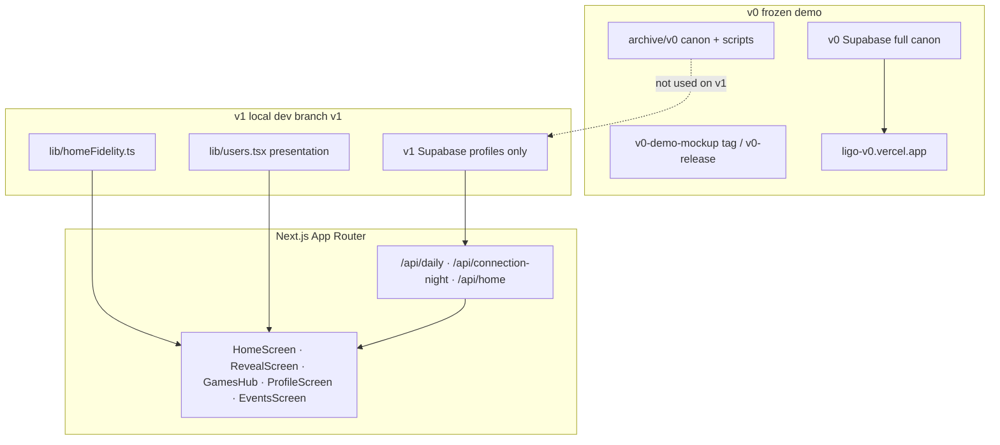

# LIGO — Demo Mockup

An interactive, clickable prototype of **LIGO** — a music-first social app for college students. The demo runs inside an iPhone frame in the browser: answer a daily question, open the nightly **Aurora reveal** at 8 PM, browse events, and explore nine demo profiles.

**New to v1?** Read **[docs/V1_DIRECTION.md](docs/V1_DIRECTION.md)** first — product pivot, daily loop, and roadmap.

**Branches:** **`v0-demo-mockup`** (git tag) is the frozen full-canon demo at [ligo-v0.vercel.app](https://ligo-v0.vercel.app). Branch **`v1`** is the new direction: nightly reveal-first mockup, profiles + catalogs in TypeScript, Supabase profiles-only. See [docs/V1_STARTING_POINT.md](docs/V1_STARTING_POINT.md) for setup; [docs/DEPLOY_V0.md](docs/DEPLOY_V0.md) for the frozen v0 deploy.

**v1 pivot (summary):** Retention is the problem; the fix is a daily music question → lock answer → **8 PM reveal** (campus pulse, personal standing, mood, forward hook). Connection Night and Weekly Wrapped are parked — code kept, home entry removed. Aurora is the chosen reveal visual direction.

---

## What this demo is trying to show

LIGO is not a generic social feed. The loop is:

1. **Daily pick** — Everyone on campus gets the same question each day. You lock in one answer (song, artist, or vibe).
2. **Nightly reveal (8 PM)** — Aurora full-screen experience: campus pulse, your standing, campus mood, forward hook. This happens **every night**.
3. **Connection Night** *(in progress)* — Hardcoded demo for all 9 profiles inside the nightly reveal when CN preview is on. See [docs/CONNECTION_NIGHT_HARDCODED_PLAN.md](docs/CONNECTION_NIGHT_HARDCODED_PLAN.md). Dynamic Supabase matching later.
4. **Ligo Wrap Night** *(later)* — End-of-week summary. Separate from the daily reveal. Code parked in repo.
5. **Profile** — Archetype, taste signals, synced catalogs, answer trail.

The demo uses **nine fictional Georgetown students** with distinct taste lanes. Switch profiles from the home top bar — news and shows vary per profile; reveal content is one demo night in slice 1 (per-profile reveal coming next).

Nothing here is “computed live” from real listening data. It is a **scripted, spreadsheet-driven demo** designed to feel coherent when you click around.

---

## The nine demo profiles

Each profile has an identity, archetype, and visual gradient. Taste is implied through their feed and matches — not enumerated here.

| ID | Name | Archetype | Vibe (one line) |
|----|------|-----------|-----------------|
| `jordan` | Jordan D. | The Hypnotist | Late-night house, Keinemusik energy, niche dancefloor head |
| `cole` | Cole B. | The Social Aux | Pregame rap/country crossover, campus party connector |
| `charlotte` | Charlotte W. | The Pop Oracle | Taylor Swift, Sabrina, Frank — main-character pop canon |
| `caroline` | Caroline M. | The Southern Romantic | Country tailgates, Morgan Wallen, heartbreak anthems |
| `maddie` | Maddie R. | The Alt Socialite | Brat summer, hyperpop, algorithm-dodging party girl |
| `bennett` | Bennett R. | The Pregame Menace | Rage rap, bass-heavy aux, chaos energy |
| `marcus` | Marcus T. | The Deep Cut Generalist | Psych-indie, house, classic rock — different lane with everyone |
| `alessia` | Alessia C. | The Afterglow | Floor-to-feelings: techno pregame, devastating afters |
| `sofia` | Sofia L. | The Mood Curator | Soft indie, Faye Webster / Clairo emotional bridge |

Profile switcher persists in `localStorage` (`ligo:active_user`). Most session state (today’s locked answer, vibe/spark taps) is local-only.

---

## Home experience

| State | What you see |
|-------|----------------|
| **Normal** | Daily pick, countdown, games hub banner, news, near-you. Marcus: after lock-in, 10s wait then reveal; replay card after dismiss. |
| **Reveal** | Aurora takeover — 5 acts (Look Up · Answer · Your Light · Sky · Tomorrow) via `RevealScreen` |
| **Games** | Ligo Games Hub — trivia, chart ranker, soundmoji |
| **Connection** *(parked)* | Legacy code; not reachable from home on v1 |
| **Wrapped** *(parked)* | Legacy code; not reachable from home on v1 |

Bottom nav: **Events · Home · Profile**.

---

## Architecture (v1)



**Design choices (v1 branch):**

- Browser calls **Next.js API routes**, not Supabase directly.
- **v1 Supabase** stores only `profiles`; daily, connection, and wrapped tables are absent — APIs return empty 200 bundles with `meta.empty: true`.
- **News and near-you** use per-profile fidelity data in [`lib/homeFidelity.ts`](lib/homeFidelity.ts) (not Supabase on v1).
- Profile presentation (playlists, receipts, streaks) stays in [`lib/users.tsx`](lib/users.tsx).
- **Full canon demo** lives at **https://ligo-v0.vercel.app** (v0 Supabase). See [`docs/V1_STARTING_POINT.md`](docs/V1_STARTING_POINT.md).

### What reads from Supabase (v1)

| Surface | API | v1 behavior |
|---------|-----|-------------|
| Daily question + answer trail | `GET /api/daily?profile=` | Empty bundle; UI: "Today's question coming soon" |
| Connection Night roster | `GET /api/connection-night?profile=` | Empty roster |
| Wrapped | `GET /api/home?profile=` | `wrapped: null`; UI: "No wrapped data yet" |
| News + near-you | `GET /api/home?profile=` | Empty from API; UI falls back to `homeFidelity.ts` |
| Profile lookup | all APIs | Requires row in `profiles` table |

On **v0** (Vercel URL), the same APIs return full spreadsheet-backed content from v0 Supabase.

### What still lives in code (v1)

| Item | Location | Notes |
|------|----------|-------|
| Profile presentation | `lib/users.tsx` | Playlists, receipts, streaks, horoscope chips, notifications |
| Song autocomplete catalogs | `lib/*-catalog.ts` | Per-profile search for daily pick lock-in |
| Events feed | `components/EventsScreen.tsx` | Not migrated to Supabase in v1 |
| Week teaser countdown | `HomeScreen.tsx` | Schedule math, not profile content |
| Session / lock-in | `localStorage` | Today’s answer, active user |

---

## Canon data (v0 only)

Full spreadsheet canon lives under [`archive/v0/`](archive/v0/) (xlsx, `home_content.json`, import scripts, migrations). It is **not** used on branch `v1`.

To run or re-seed v0 locally, see [`archive/v0/README.md`](archive/v0/README.md) and [`docs/DEPLOY_V0.md`](docs/DEPLOY_V0.md). For sharing the full demo, use **https://ligo-v0.vercel.app**.

---

## Setup (v1 local)

See [`docs/V1_STARTING_POINT.md`](docs/V1_STARTING_POINT.md) for the full walkthrough.

### 1. Install and env

```bash
npm install
cp .env.example .env.local
```

Point `.env.local` at your **v1** Supabase project (not v0):

```env
NEXT_PUBLIC_SUPABASE_URL=...
NEXT_PUBLIC_SUPABASE_ANON_KEY=...
SUPABASE_SERVICE_ROLE_KEY=...   # import:profiles only — never commit
```

### 2. Database

Run [`supabase/migrations/001_v1_profiles_only.sql`](supabase/migrations/001_v1_profiles_only.sql) in the Supabase SQL Editor (or `npm run db:migrate` with `DATABASE_URL`).

### 3. Seed profiles

```bash
npm run import:profiles
```

Dry run: `npm run import:profiles:dry`.

### 4. Run

```bash
npm run dev
```

Open http://localhost:3000. Use `npm run dev:clean` if you hit stale `.next` errors after switching branches.

**Marcus reveal demo:** default profile is Marcus. Lock an answer, wait 10s for auto-reveal, or reset in the browser console:

```js
localStorage.removeItem('ligo:reveal:marcus:unlocked');
localStorage.removeItem('ligo:daily:marcus:answered');
```

**Night Preview:** use the N1–N10 buttons above the phone to preview aurora progression across demo nights.

**v0 full demo:** https://ligo-v0.vercel.app — no local v0 setup required.

---

## Project structure

```
app/
  page.tsx                 Phone shell — Home / Events / Profile tabs
  api/
    daily/route.ts           Daily reveal bundle
    connection-night/route.ts
    home/route.ts
    auth/route.ts            Password gate
    dev/canon/route.ts       Dev canon inspector
components/
  HomeScreen.tsx             Normal · Reveal · Games · Connection · Wrapped
  RevealScreen.tsx           Aurora nightly reveal (5 acts)
  RevealShell.tsx            Shared cinematic shell
  GamesHub.tsx               Games hub + GamePlayer
  EventsScreen.tsx           Events tab (TS mock data)
  profile/ProfileScreen.tsx  Profile v2 + answer trail
  IOSDevice.tsx              iPhone frame
hooks/
  useDailyReveal.ts
  useConnectionNight.ts
  useHomeContent.ts
lib/
  users.tsx                  Profile presentation blobs
  dailyReveal.ts             Day resolution (ET window)
  connectionNight.ts         Roster → carousel mapping
  sharedPickRule.ts          Shared-pick card rules
  wrappedUtils.ts            Wrapped parse + normalize (no JSON fallback)
  supabase/                  Client, server, queries, emptyBundles
scripts/
  import-profiles.ts         Seed profiles → v1 Supabase
  apply-migration.ts
supabase/migrations/         001_v1_profiles_only.sql
archive/v0/                  Frozen v0 canon, scripts, migrations
public/                      Covers, artist photos, fonts, assets
archive/investor-demo/       Offline investor deck (not part of runtime demo)
docs/                        Phase plans and implementation notes
```

---

## npm scripts

| Script | Purpose |
|--------|---------|
| `npm run dev` | Development server |
| `npm run dev:clean` | Clear `.next`, start on port 3000 |
| `npm run db:migrate` | Apply SQL migrations (needs DB URL) |
| `npm run import:profiles` | Seed nine demo profiles into v1 Supabase |
| `npm run import:profiles:dry` | Dry run for profile import |

---

## Design system

Visual language comes from the LIGO design kit: **Bricolage Grotesque**, warm neutrals, orange/yellow/purple accents, glass cards on dark takeover screens. Tokens live in `app/globals.css`, `app/home.css`, and `app/events.css`.

---

## Out of scope for v1

These were intentionally deferred:

- **Profile blobs in Supabase** (playlists, receipts, streaks) — still in `users.tsx`
- **Catalog songs in Supabase** — autocomplete uses per-profile TS catalogs
- **Events feed backend** — still hardcoded in `EventsScreen.tsx`
- **Live Wrapped** computed from real answers or attendance
- **Real auth / multi-user** — password gate + fictional profiles only

See `docs/SUPABASE_IMPLEMENTATION_PLAN.md` and `docs/PHASE_5_HOME_CONTENT_PLAN.md` for phase history.

---

## Starting a new experiment from this repo

Stay on branch **`v1`**, keep v1 Supabase keys in `.env.local`, and add tables/features as needed. v0 remains frozen at tag **`v0-demo-mockup`** and **https://ligo-v0.vercel.app**.

```bash
git checkout v1
git checkout -b experiment/my-idea
```

---

## Stack

- **Next.js 14** (App Router) · **React 18** · **TypeScript**
- **Supabase** (Postgres + RLS)
- **Tailwind CSS** · design tokens in CSS
- Deployable on **Vercel** — v0 at `ligo-v0`; v1 optional with v1 Supabase env vars

---

## License / usage

Private demo mockup. Fictional students, fictional copy, third-party artist imagery for presentation only.
