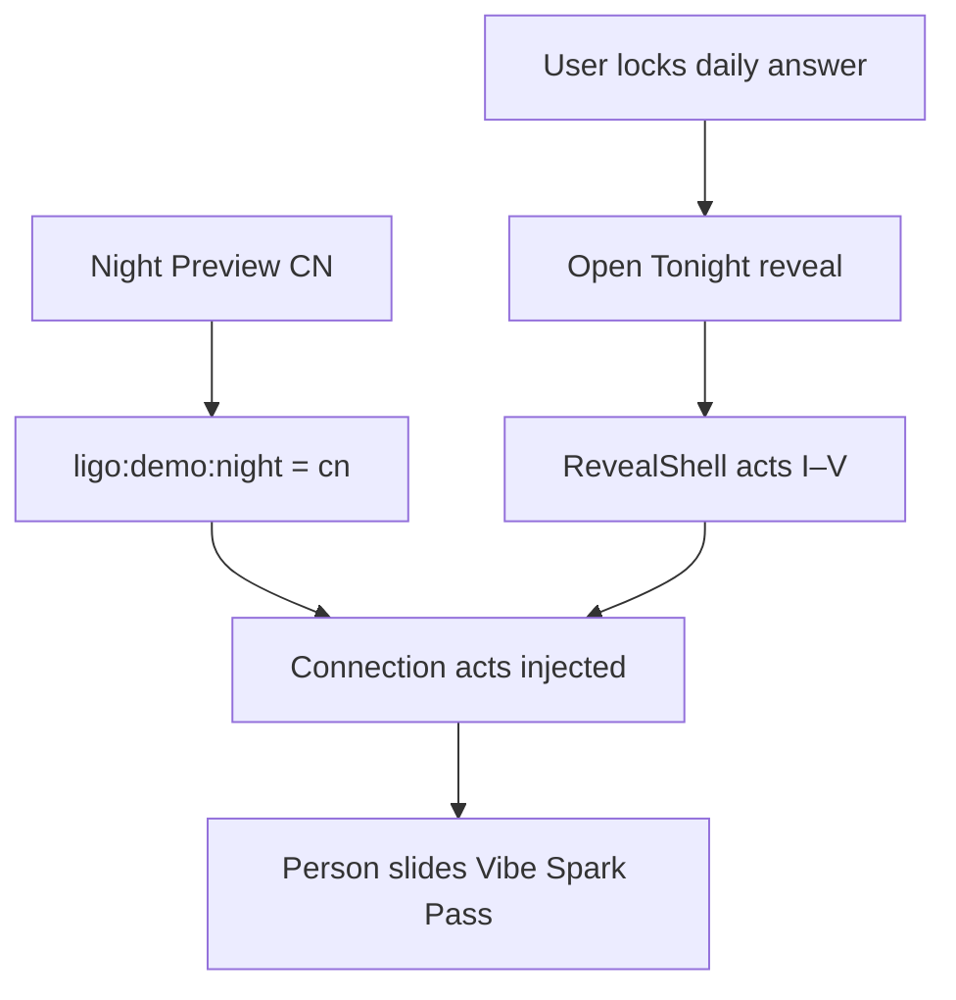

# Connection Night — Hardcoded Demo Plan (v1)

**Audience:** Design, engineering, anyone wiring Connection Night into the v1 mockup.

**Status:** Plan — not yet implemented.

**Related:** [V1_DIRECTION.md](./V1_DIRECTION.md) · [V1_STARTING_POINT.md](./V1_STARTING_POINT.md) · frozen full canon at [ligo-v0.vercel.app](https://ligo-v0.vercel.app)

---

## Summary

Connection Night will ship in v1 as **hardcoded TypeScript data** for all **nine demo profiles** — no Supabase roster, no spreadsheet import. Made-up answers and “why you matched” copy are fine for now. The graph should be **mutually consistent**: if Cole sees Caroline, Caroline sees Cole.

Later we replace the hardcoded bundle with live data (`connection_roster` + `daily_answers` from Supabase, same as v0). The UI and hook shape stay the same.

---

## Why hardcode (for now)

| | v1 today | v0 (frozen) |
|---|----------|-------------|
| Supabase | `profiles` table only | Full canon (`connection_roster`, `daily_answers`, …) |
| `/api/connection-night` | Returns `connectionRoster: []`, `meta.empty: true` | Full spreadsheet-backed rosters |
| Aurora reveal | Hardcoded in `lib/revealData.ts` (N1–N10) | Same pattern we’re copying |

Hardcoding matches how nightly reveal already works: **ship the UX first**, plug in real data when the canvas is ready.

---

## Product intent (unchanged)

Connection Night is **not** a separate home button anymore.

1. User does the normal daily loop (question → lock answer → nightly reveal).
2. **1–2× per week**, the same “Look up, Georgetown” reveal gains extra act(s): surfaced matches, horoscope copy, Vibe / Spark / Pass.
3. User never knows in advance which night is Connection Night (demo: **CN** flag on Night Preview toolbar).

v0 treated Connection Night as the whole reveal. v1 nests it **inside** the Aurora reveal shell (`RevealShell`).

---

## What already exists in the repo

| Asset | Location | Role |
|-------|----------|------|
| Carousel UI | `components/HomeScreen.tsx` → `ConnectionReveal`, `PersonSlide`, `DoneSlide` | Sealed → story slides → Vibe/Spark/Pass |
| Reveal shell | `components/RevealShell.tsx` | Shared act progression, aurora backdrop (`CONNECTION_COLORS`) |
| Data hook | `hooks/useConnectionNight.ts` | Fetches `/api/connection-night`, maps roster → people |
| Roster mapping | `lib/connectionNight.ts` | `mapRosterToPeople`, `songFromAnswer` |
| Profile identity | `lib/users.tsx` | Names, archetypes, gradients, year — **do not duplicate** |
| Shared-pick pairs | `lib/sharedPickRule.ts` | 16 undirected pairs (e.g. Cole+Caroline → Morgan Wallen) |
| API route | `app/api/connection-night/route.ts` | Ready for DB; returns empty on v1 |
| CN preview flag | `lib/revealConstants.ts` → `isConnectionNightPreview()` | Set when Night Preview **CN** is selected (`ligo:demo:night = "cn"`) |

**Not wired yet:** CN button → reveal flow; demo data file; hook fallback when API is empty.

---

## Hardcoded data model

One bundle per profile id (`jordan`, `cole`, `marcus`, …):

```ts
type ConnectionNightDemoBundle = {
  /** Shown on sealed screen + each person slide — "your pick tonight" */
  currentAnswer: {
    answer_text: string;   // e.g. "Self Control — Frank Ocean"
    title?: string;
    artist?: string;
    cover_url?: string;    // optional; else coverArtForAnswer heuristic
  };
  /** 3–4 matches, ranked */
  connectionRoster: ConnectionRosterRow[];
  /**
   * Optional: minimal fake answers for week-grid pips.
   * If omitted, slides use shared_lane or sharedPickRule only.
   */
  dailyAnswers?: DailyAnswerRow[];
  matchAnswersById?: Record<string, DailyAnswerRow[]>;
  dailyQuestions?: DailyQuestionRow[];
  currentDayNumber?: number;  // default 28 for demo window
};
```

### Per roster row (`ConnectionRosterRow`)

| Field | Example | Notes |
|-------|---------|--------|
| `viewer_id` | `"cole"` | Who is viewing |
| `rank` | `1` | Carousel order |
| `match_id` | `"caroline"` | Must exist in `lib/users.tsx` |
| `score` | `87` | Shown on slide header |
| `match_type` | `"Vibe"` or `"Spark"` | Friend vs romantic lane hint |
| `shared_lane` | `"late-night R&B"` | Shown when no shared-pick card |
| `why_copy` | 1–2 sentences | “Connection reading” horoscope — **write per viewer→match** |
| `headline_overlap` | optional | Rarely surfaced in UI today |

Identity fields (name, archetype, avatar gradient) come from `USERS[match_id]` at map time — **not** stored in the demo bundle.

### Consistency rules (demo graph)

1. **Mutual visibility** — If A’s roster includes B, B’s roster should include A (ranks/scores can differ).
2. **Reuse `SHARED_PICK_RULES`** — Pairs with `show: true` get a “Shared pick” card automatically via `sharedPickCardForPair()`.
3. **Tonight’s pick** — Can be one campus-wide song for Connection Night demo (e.g. Frank Ocean / Self Control) or per-profile; keep simple at first.
4. **Copy doesn’t need to be mathematically true** — Demo fiction; it only needs to feel coherent when switching profiles.

### Suggested match graph (starter — edit freely)

| Viewer | Matches (rank order) |
|--------|----------------------|
| Cole | Caroline, Charlotte, Marcus |
| Caroline | Cole, Charlotte, Maddie |
| Charlotte | Cole, Caroline, Sofia |
| Marcus | Maddie, Cole, Jordan |
| Maddie | Marcus, Alessia, Caroline |
| Alessia | Maddie, Sofia, Jordan |
| Sofia | Charlotte, Alessia, Bennett |
| Bennett | Jordan, Sofia, Cole |
| Jordan | Marcus, Bennett, Alessia |

Adjust copy per directed edge (`cole→caroline` ≠ `caroline→cole` voice).

---

## Runtime flow (target)



### Data resolution order

```
useConnectionNight(viewerId)
  → fetch /api/connection-night?profile=
  → if roster.length === 0 OR isConnectionNightPreview()
       use getConnectionNightDemoBundle(viewerId) from lib/connectionNightDemo.ts
  → mapRosterToPeople(...)
```

API can stay as-is; fallback lives in the hook (or optionally in the route for SSR consistency later).

---

## Implementation checklist

### Phase 1 — Data (this doc)

- [x] Create `lib/connectionNightDemo.ts`
  - [x] `CONNECTION_NIGHT_BUNDLES: Record<string, ConnectionNightDemoBundle>`
  - [x] `getConnectionNightDemoBundle(profileId: string)`
  - [x] All 9 profiles, 3 matches each, `why_copy` per edge
- [x] Reuse existing shared-pick pairs where possible (`lib/sharedPickRule.ts`)

### Phase 2 — Hook fallback

- [x] Update `hooks/useConnectionNight.ts` to use demo bundle when API returns empty roster
- [x] Prefer demo when `isConnectionNightPreview()` is true (CN toolbar)

### Phase 3 — Wire CN into reveal

- [x] `RevealScreen` reads `isConnectionNightPreview()`
- [x] Insert Connection acts after **Your Light** (Act III)
- [x] `components/reveal/ConnectionNightActs.tsx` — sealed, person, done acts
- [x] `RevealShell` palette: `CONNECTION_COLORS` when CN preview on
- [ ] No separate `state === 'connection'` home route for demo; CN is only via preview flag + future “surprise night” logic

### Phase 4 — Polish

- [ ] Per-profile tonight pick aligned with locked daily answer when possible
- [ ] Profile gate / anonymity (`lib/profileGate.tsx`) — defer unless design requires
- [ ] Meetup sheet after Vibe — already in `HomeScreen`; ensure it still works from nested reveal

### Phase 5 — Later (dynamic)

- [ ] Import v0 canon into v1 Supabase **or** new matching pipeline
- [ ] Remove demo fallback when `connectionRoster.length > 0`
- [ ] Real “1–2× per week” scheduler (not CN toolbar)
- [ ] Merge daily question + connection pick day alignment (`lib/dailyReveal.ts` shared `currentDayNumber`)

---

## Files to touch

| File | Change |
|------|--------|
| `lib/connectionNightDemo.ts` | **New** — all hardcoded bundles |
| `hooks/useConnectionNight.ts` | Demo fallback |
| `components/RevealScreen.tsx` | Conditional connection acts |
| `components/RevealShell.tsx` | Possibly export shared step helpers (already shared) |
| `components/HomeScreen.tsx` | `ConnectionReveal` / `PersonSlide` — extract or import into reveal |
| `lib/revealConstants.ts` | `isConnectionNightPreview()` — already exists |
| `app/page.tsx` | CN button — already sets flag |

**Do not change for this slice:** v0 Supabase, `archive/v0/` import scripts, production env vars.

---

## Testing the demo

1. `npm run dev` → http://localhost:3001
2. Click **CN** in Night Preview (page reloads).
3. Switch to a profile (e.g. Cole) — UI resets per profile.
4. Lock in any answer (or use existing lock).
5. Open **Tonight’s reveal**.
6. Expect Aurora acts + Connection carousel with 3–4 matches.
7. Switch to Caroline — should see Cole in her roster with different `why_copy`.
8. Click **LIVE** on Night Preview to return to normal aurora-only nights.

---

## What we are explicitly not doing yet

- Real matching algorithm or niche coefficient
- Writing answers back to Supabase
- DAU thresholds / empty roster recovery copy
- Wrap Night
- Per-campus dynamic copy generation
- Guaranteeing demo answers match `useDailyReveal` API question text

---

## Reference: v0 full canon

If you need copy or roster inspiration (not runtime on v1):

- Spreadsheets: `archive/v0/canon/`
- Import: `archive/v0/scripts/import-canon.ts`
- Live demo: [ligo-v0.vercel.app](https://ligo-v0.vercel.app) with v0 Supabase keys

Do not point v1 deployments at the v0 Supabase project.

---

## Open questions for design

1. **Which act slot** does Connection Night land in? (After Your Light vs after Sky)
2. **Sealed opening** — same “Look up, Georgetown” or a distinct “connections surfaced” beat?
3. **Hint on non-CN nights** — zero hint vs subtle foreshadowing?
4. **Match count** — 3 vs 4 per profile for demo pacing?

Capture decisions here as they land.
