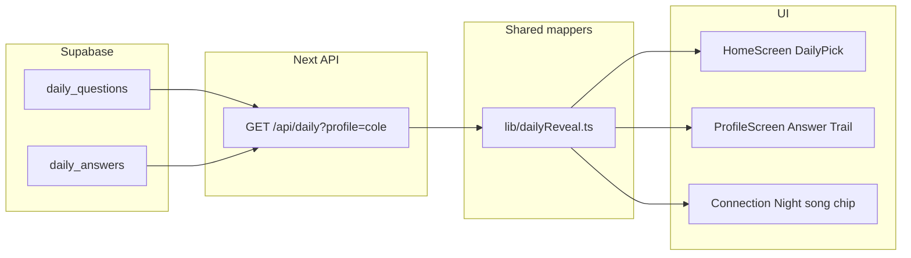

# Phase 4 — Daily Reveal + Answer Trail

Wire the home **Daily Pick** and Profile **Answer Trail** to Supabase canon (`daily_questions` + `daily_answers`). Fixes the structural mismatch where Connection Night, daily pick, and profile history all tell different stories.

**Prerequisite:** Phase 1 complete, Phase 3 Connection Night wired (`useConnectionNight` + `/api/connection-night`).

**Out of scope for Phase 4:** Receipts easter eggs, full 28-day archive page, catalog search in DB (Phase 2b), writing answers back to Supabase (real users later).

---

## Problem today

| Surface | Current source | Issue |
|---------|----------------|-------|
| Daily Pick question | Hardcoded string in `HomeScreen.tsx` | Same prompt for all 9 profiles |
| Daily Pick lock-in | `localStorage` (`ligo:daily:answered`, `ligo:daily:answer`) | Session fiction — OK for demo v1 |
| Answer Trail | `users.tsx` → `profile.answerTrail` (7 hand-written rows) | Doesn't match 28-day matrix |
| Connection Night “your pick” | `tonightAnswerFromDaily()` → **max `day_number`** | Wrong day; should share “current day” with Daily Pick |

Canon is in Supabase (28 questions × 252 answers). UI still reads TS blobs.

---

## Core concept: demo “current day”

The matrix has 28 scheduled days. The demo needs **one active `day_number` per session** that all surfaces agree on.

### Current day rule (v1) — window clamp, never blank

Canon window: **2026-05-08 (day 1) through 2026-06-04 (day 28)**.

```
if today (ET) < 2026-05-08 OR today (ET) > 2026-06-04 → currentDayNumber = 28
else → max day_number where scheduled_date <= today (ET)
```

Past the window (e.g. Jun 5+) always lands on **day 28** — never blank.

### Shared helper (single source)

Add `lib/dailyReveal.ts`:

- `resolveCurrentDayNumber(questions, nowEt?)` → `day_number`
- `getQuestionForDay(questions, dayNumber)` → `DailyQuestionRow`
- `getAnswerForDay(answers, dayNumber)` → `DailyAnswerRow | null`
- `mapAnswerTrailSlice(questions, answers, currentDay, count = 7)` → UI rows

**Refactor Connection Night** to use the same `currentDayNumber` + `getAnswerForDay` instead of `tonightAnswerFromDaily()` (max day). Small follow-up inside Phase 4.

---

## Architecture



**Fetch pattern:** Same as Phase 3 — browser calls **server API route**, not Supabase client directly (avoids env / RLS issues in the browser).

---

## Phase 4a — Read layer + API

### New files

| File | Purpose |
|------|---------|
| `lib/dailyReveal.ts` | Day resolution, trail mapping, answer display helpers |
| `lib/supabase/queries/daily.ts` | `getDailyQuestions()`, `getDailyAnswersForProfile()` (or extend `canon.ts`) |
| `hooks/useDailyReveal.ts` | Fetch + cache per `activeUserId` |
| `app/api/daily/route.ts` | `GET /api/daily?profile=cole` |

### API response shape

```json
{
  "profileId": "cole",
  "currentDayNumber": 14,
  "currentQuestion": {
    "day_number": 14,
    "question_text": "...",
    "answer_type": "Artist",
    "weekday": "Wed",
    "scheduled_date": "2026-05-21"
  },
  "currentAnswer": {
    "answer_text": "Morgan Wallen",
    "answer_kind": "artist",
    "artist": "Morgan Wallen",
    "title": null,
    "cover_url": null
  },
  "answerTrail": [
    { "dayLabel": "Today", "weekday": "Wed", "day_number": 14, "song": "Morgan Wallen", "artist": "Morgan Wallen", "today": true },
    { "dayLabel": "Tue", "weekday": "Tue", "day_number": 13, "song": "...", "artist": "...", "today": false }
  ],
  "meta": { "trailCount": 7, "totalAnswers": 28 }
}
```

### Trail mapping rules

1. Take days `[currentDayNumber - 6 … currentDayNumber]` (inclusive), join question + answer.
2. **Labels:** `day_number === currentDayNumber` → `"Today"`; else use `daily_questions.weekday` abbreviated (`Mon`, `Tue`, …).
3. **Song / artist display:**
   - `answer_kind === 'song'` → `title` + `artist` (parse ` — ` if needed)
   - `answer_kind === 'artist'` → song field = artist name, artist field empty or repeat
   - `answer_kind === 'genre'` → song field = genre text
4. **Cover:** use `cover_url` if set; else same best-effort helper as Connection Night (`coverArtForAnswer` — move to shared util or re-export from `connectionNight.ts`).

### Queries to add

```ts
getDailyQuestions(supabase)           // 28 rows, order by day_number
getDailyAnswersForProfile(supabase, profileId)  // already exists in canon.ts
getDailyBundle(supabase, profileId)   // questions + answers + computed current day + trail
```

---

## Phase 4b — Wire Home Daily Pick

**File:** `components/HomeScreen.tsx` → `DailyPick`

### Read from canon

- Replace hardcoded `<h2>What artist did you grow up on…</h2>` with `currentQuestion.question_text`.
- Optional eyebrow: show `answer_type` hint (`Song` / `Artist` / `Genre`) — subtle, matches matrix.
- Loading skeleton while `useDailyReveal` fetches; error state with retry (mirror Connection Night).

### Keep session behavior (v1)

| State | Storage | Behavior |
|-------|---------|----------|
| User typed answer | `ligo:daily:answer` | Unchanged |
| Locked in? | `ligo:daily:answered` | Unchanged |
| Catalog autocomplete | `lib/*-catalog.ts` | Unchanged until Phase 2b |

**Demo enhancement (optional):** On first visit per profile/day, if `!answered`, show placeholder from canon `currentAnswer.answer_text` in the input (grey hint, not locked). Helps demos match matrix without forcing lock-in.

### Do not change (yet)

- Countdown / Timeline (`CountdownBar`, `Timeline`) — still ET clock fiction
- `CountdownBar` “847 answered” social proof — static demo copy

---

## Phase 4c — Wire Profile Answer Trail

**File:** `components/profile/ProfileScreen.tsx` → `ProfileTabV2` Answer Trail section (~line 1014)

### Replace data source

- **Before:** `profile.answerTrail.map(...)` from `users.tsx`
- **After:** `useDailyReveal(activeUserId).answerTrail` (or pass from provider)

### UI

- Keep existing horizontal scroll cards (124px width, today highlight).
- Keys: use `day_number` not `day` string.
- Empty/loading: skeleton chips or “Loading your trail…”

### Privacy (unchanged product rule)

- Answer Trail shows **only the active profile’s** answers — already true; no other users’ names.
- Gate / Connection Night anonymity unchanged.

### Cleanup (after validation)

- Stop maintaining `answerTrail` arrays in `lib/users.tsx` (leave field as `[]` or remove from type in a later cleanup commit).
- Do **not** remove other `profile.*` blobs yet (playlists, receipts, etc.).

---

## Phase 4d — Align Connection Night pick

**Files:** `lib/connectionNight.ts`, `hooks/useConnectionNight.ts`, optionally `/api/connection-night`

- Replace `tonightAnswerFromDaily(answers)` (max day) with shared `resolveCurrentDayNumber` + `getAnswerForDay`.
- Optionally include `currentDayNumber` in connection-night API response for debugging.

**Done when:** Cole Connection Night “Your pick tonight” matches Daily Pick locked/canonical answer for the same demo day.

---

## Phase 4e — Dev validation

### Endpoint

`GET /api/daily?profile=cole` — same pattern as `/api/dev/canon`, production-safe read-only.

### Spot-checks (success criteria)

| Check | Expected |
|-------|----------|
| Cole `currentDayNumber` | Consistent across `/api/daily` and Connection Night |
| Cole day 14 answer | `Morgan Wallen` (artist) |
| Caroline day 14 | Same `answer_text` (overlap day) |
| Answer Trail length | 7 rows ending at current day |
| Jordan question text | Matches matrix row for current day, not hardcoded grow-up prompt |
| Profile switch | Trail + question reload per `activeUserId` |
| Offline / no Supabase | Clear error, no silent fallback to wrong TS data |

### Manual QA script

1. Set `ligo:demo_day=14` in localStorage (if override implemented) → Cole everywhere shows Morgan Wallen.
2. Open Home → question matches matrix day 14.
3. Open Profile → trail last chip is Today / Morgan Wallen.
4. Open Connection Night → same pick on sealed + slides.

---

## Build order

| Step | Deliverable | Done when |
|------|-------------|-----------|
| **4a** | `lib/dailyReveal.ts` + `/api/daily` + `useDailyReveal` | API returns Cole bundle with 7-row trail |
| **4b** | `DailyPick` reads question from hook | Home question text varies by profile + day |
| **4c** | Profile Answer Trail from hook | Cole trail matches matrix last 7 days |
| **4d** | Connection Night uses shared day logic | “Your pick tonight” aligned |
| **4e** | Spot-checks + doc update | Success table passes |

**Recommendation:** Ship 4a → validate API → then 4b + 4c in one PR, 4d as small follow-up in same PR.

---

## Files to add/change

| Path | Action |
|------|--------|
| `lib/dailyReveal.ts` | Create — day resolution + trail mapper |
| `lib/supabase/queries/daily.ts` | Create (or extend `canon.ts`) |
| `hooks/useDailyReveal.ts` | Create |
| `app/api/daily/route.ts` | Create |
| `components/HomeScreen.tsx` | Wire `DailyPick` |
| `components/profile/ProfileScreen.tsx` | Wire Answer Trail |
| `lib/connectionNight.ts` | Refactor pick-day logic |
| `hooks/useConnectionNight.ts` | Use shared day resolution |
| `docs/SUPABASE_IMPLEMENTATION_PLAN.md` | Mark Phase 4 steps, link this doc |

---

## Session vs canon (explicit)

| Data | Source | Phase 4 |
|------|--------|---------|
| Today’s question | Supabase `daily_questions` | **Read from DB** |
| History trail (7 days) | Supabase `daily_answers` | **Read from DB** |
| User’s lock-in today | `localStorage` | **Keep local** (demo session) |
| Catalog autocomplete | `lib/*-catalog.ts` | **Keep local** until 2b |
| Receipts / streaks / playlists | `users.tsx` | **Unchanged** |

---

## Optional: demo day override

For repeatable demos and QA:

```ts
// localStorage ligo:demo_day = "14"  → force day_number 14
// unset → use scheduled_date rule
```

Expose only in dev (or hidden long-press) — not required for v1 launch.

---

## Risks / decisions

1. **Real calendar vs fixed demo day** — If matrix dates don’t span “today” in ET, fallback day 28 avoids blank UI but may confuse QA. Document in `.env.example`: `NEXT_PUBLIC_DEMO_DAY=28` optional override.

2. **Question HTML** — Matrix questions are plain text. If any contain markdown/bold, render as plain text first; add formatting later.

3. **Artist-only answers** — UI currently expects `song` + `artist`. Mapper must handle artist/genre kinds without breaking trail layout.

4. **Performance** — One API call per profile switch is fine for demo. Optionally combine `/api/daily` + `/api/connection-night` later into `/api/home-bundle` — not needed for Phase 4.

---

## Bottom line

Phase 4 is one shared **“current day”** concept, one API, one hook, two UI surfaces (Home + Profile), plus a small Connection Night fix. No new tables. No writes. Canon answers become the single source for what each profile actually said — session lock-in stays fake until real auth.
