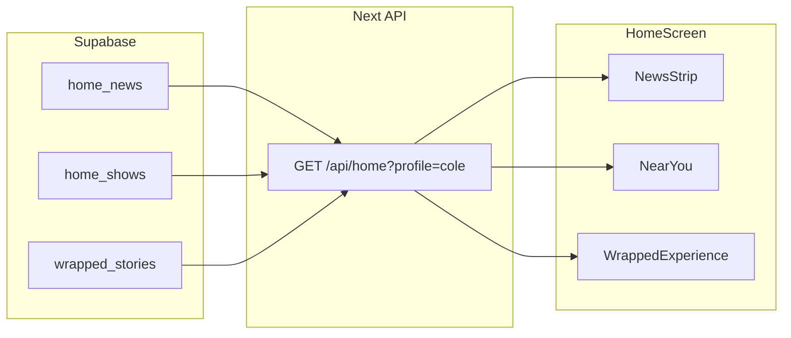

# Phase 5 — Home content off TS blobs

Move the **normal home feed** (news strip, near-you shows, wrapped story) from `HomeScreen.tsx` into Supabase. Same pattern as Phases 3–4: server API + hook + thin UI swap.

**Prerequisite:** Phases 1–4 complete (canon in Supabase; Daily Pick, Answer Trail, Connection Night wired).

**Out of scope for Phase 5:** `profile_content` / full `users.tsx` migration (Phase 2a), `catalog_songs` autocomplete (Phase 2b), computing wrapped stats from live answers, Week teaser countdown schedule changes.

---

## Problem today

| Surface | Current source | Issue |
|---------|----------------|-------|
| News strip (“Your artists this week”) | `NEWS`, `COLE_NEWS`, … per profile in `HomeScreen.tsx` | ~45 hand-maintained cards across 9 profiles |
| Near you shows | `SHOWS`, `COLE_SHOWS`, … | ~18 hand-maintained rows |
| Wrapped story | `WRAPPED_DATA` object in `HomeScreen.tsx` | ~400 lines of nested slide/theme copy per profile |
| Week teasers | `WeekTeasers` + countdown helpers | **Stays in code** — schedule math, not content |

Home normal state still reads TypeScript blobs while canon daily + connection data lives in Supabase.

---

## What stays in code (v1)

| Item | Why |
|------|-----|
| `WeekTeasers` countdown | Derived from `nextWeekly()` — not profile content |
| Daily Pick session | `localStorage` lock-in + catalog autocomplete unchanged |
| Connection Night | Already on `/api/connection-night` |
| Assets | Covers/photos stay in `public/`; DB stores paths only |

---

## Architecture



Browser fetches server API — **not** client Supabase (same lesson as Connection Night / daily).

---

## Database schema — `002_home_content.sql`

### `home_news`

Carousel cards in **Your artists this week**.

| Column | Type | Notes |
|--------|------|--------|
| `id` | uuid PK | default `gen_random_uuid()` |
| `profile_id` | text FK → `profiles` | `cole`, `jordan`, … |
| `sort_order` | int | 0-based carousel order |
| `art_url` | text | `/covers/...` or `/artists/...` |
| `source_label` | text | Breaking, Ligo Radar, Campus chart, … |
| `time_label` | text | 1h, 3h, 1d |
| `headline` | text | card body copy |

**Unique:** `(profile_id, sort_order)`

**Expected row count:** ~45 (9 profiles × ~5 cards; Jordan uses default `NEWS` set)

---

### `home_shows`

**Near you** list items.

| Column | Type | Notes |
|--------|------|--------|
| `id` | uuid PK | |
| `profile_id` | text FK → `profiles` | |
| `sort_order` | int | |
| `name` | text | show title |
| `venue` | text | venue + on/off campus hint |
| `when_label` | text | Tonight 8:00, Fri 9:30 |
| `tag` | text | Free, $5, $120 |
| `tag_style` | text | `green` \| `orange` (maps to `TAG_STYLE` in UI) |
| `art_url` | text | |

**Unique:** `(profile_id, sort_order)`

**Expected row count:** ~18 (9 profiles × ~2 shows)

---

### `wrapped_stories`

Full-screen **Wrapped** carousel per profile.

| Column | Type | Notes |
|--------|------|--------|
| `profile_id` | text PK FK → `profiles` | |
| `content` | jsonb | entire `WRAPPED_DATA[profile]` blob |

**Why JSONB:** five slides + theme tokens per profile; flattening buys little for demo v1. Split into tables later if needed.

**Expected row count:** 8 wired today (maddie, jordan, charlotte, cole, caroline, bennett, marcus, alessia). **Sofia** missing — fallback to jordan until seeded.

**Marcus note:** current `WRAPPED_DATA.marcus` uses a different shape (`heroAccent`, `friends`, …) than slide-based profiles. Normalize to standard slide schema during export or keep as jsonb and handle in mapper.

---

### RLS

```sql
-- Public read, no client write (demo v1)
ALTER TABLE home_news ENABLE ROW LEVEL SECURITY;
CREATE POLICY "public read" ON home_news FOR SELECT USING (true);
-- Same for home_shows, wrapped_stories
```

Writes via **service role** in import script only.

---

## Import pipeline

```
HomeScreen.tsx constants (one-time)
        │
        ▼
scripts/export-home-content.ts  →  data/canon/home_content.json
        │
        ▼
scripts/import-home-content.ts  →  Supabase upsert
        │
        └── home_news, home_shows, wrapped_stories
```

### Export script responsibilities

1. Extract `NEWS` / `*_NEWS` → `news[]` keyed by `profile_id`
2. Extract `SHOWS` / `*_SHOWS` → `shows[]` keyed by `profile_id`
3. Extract `WRAPPED_DATA` → `wrapped{}` keyed by `profile_id`
4. Validate: 9 profiles for news/shows; flag missing wrapped

### Import script responsibilities

1. Idempotent upsert on `(profile_id, sort_order)` for news/shows
2. Upsert `wrapped_stories` on `profile_id`
3. Print summary counts + mismatches

**npm script:** `import:home` (and optional `export:home` for re-snapshot from TS)

---

## API response

`GET /api/home?profile=cole` returns:

```json
{
  "profileId": "cole",
  "news": [
    {
      "sort_order": 0,
      "art_url": "/artists/travisscott-profile.jpeg",
      "source_label": "Tour",
      "time_label": "1h",
      "headline": "Travis Scott announced 4 new dates for the Utopia tour."
    }
  ],
  "shows": [
    {
      "sort_order": 0,
      "name": "Travis Scott Utopia Tour",
      "venue": "Capital One Arena",
      "when_label": "Thu 8:00",
      "tag": "$120",
      "tag_style": "orange",
      "art_url": "/covers/travisscott-utopia.jpeg"
    }
  ],
  "wrapped": { "meshClass": "...", "slide1": { ... }, ... }
}
```

---

## Read layer + hook

| File | Purpose |
|------|---------|
| `lib/supabase/queries/home.ts` | `getHomeNews`, `getHomeShows`, `getWrappedStory`, `getHomeBundle` |
| `app/api/home/route.ts` | Server read + JSON bundle |
| `hooks/useHomeContent.ts` | `fetch('/api/home?profile=...')` per `activeUserId` |

Types in `lib/supabase/types.ts` for `HomeNewsRow`, `HomeShowRow`, `WrappedStoryRow`.

---

## UI wiring

### 5b — NewsStrip (`~line 147`)

- **Before:** `activeUserId === 'cole' ? COLE_NEWS : …`
- **After:** `useHomeContent(activeUserId).news`
- Loading / error states (mirror `useDailyReveal`)
- **Keep unchanged:** card layout, horizontal scroll, styling

### 5c — NearYou (`~line 704`)

- **After:** `useHomeContent(activeUserId).shows`
- **Keep in code:** `TAG_STYLE` map (`green` / `orange` → CSS)

### 5d — WrappedExperience (`~line 1518`)

- **After:** `useHomeContent(activeUserId).wrapped` (or lazy fetch when `state === 'wrapped'`)
- Fallback: `wrapped ?? jordan` if profile missing
- **Keep unchanged:** slide components, animations, `WeekTeasers` entry from home normal

### Cleanup (after validation)

- Delete `NEWS`, `CHARLOTTE_NEWS`, … `ALESSIA_NEWS`
- Delete `SHOWS`, `CHARLOTTE_SHOWS`, … `ALESSIA_SHOWS`
- Delete `WRAPPED_DATA` object from `HomeScreen.tsx`

---

## Build order

| Step | Deliverable | Done when |
|------|-------------|-----------|
| **5a** | `002_home_content.sql` + export/import + `/api/home` + `useHomeContent` | API returns Cole bundle (5 news, 2 shows, wrapped) |
| **5b** | Wire `NewsStrip` | Cards from DB per profile |
| **5c** | Wire `NearYou` | Shows from DB per profile |
| **5d** | Wire `WrappedExperience` | Story from DB; profile switch reloads |
| **5e** | Spot-checks + doc update | Success table passes |

**Recommendation:** Ship **5a → validate API → 5b+5c** in one PR; **5d** can follow (wrapped is largest + Marcus shape).

---

## Validation (5e)

| Check | Expected |
|-------|----------|
| `GET /api/home?profile=cole` | 5 news rows, 2 show rows, wrapped JSON present |
| `GET /api/home?profile=jordan` | Default news set (not Cole's Travis Scott cards) |
| Profile switch on home | News + shows reload per `activeUserId` |
| Open Wrapped as Cole | “The Social Aux” story, not Jordan Hypnotist |
| No Supabase / API error | Clear error state; no silent TS fallback after cleanup |
| Import counts | ~45 news, ~18 shows, ≥8 wrapped |

### Manual QA

1. Home → scroll news strip as Cole → Travis Scott / Morgan Wallen headlines
2. Near you → Utopia + tailgate for Cole
3. Week teaser → Wrapped → Cole slide 1 title “The Social Aux”
4. Switch to Charlotte → news/shows change; wrapped changes

---

## Files to add/change

| Path | Action |
|------|--------|
| `supabase/migrations/002_home_content.sql` | Create — 3 tables + RLS |
| `data/canon/home_content.json` | Create — exported snapshot |
| `scripts/export-home-content.ts` | Create — one-time TS → JSON |
| `scripts/import-home-content.ts` | Create — JSON → Supabase |
| `lib/supabase/queries/home.ts` | Create |
| `lib/supabase/types.ts` | Extend types |
| `app/api/home/route.ts` | Create |
| `hooks/useHomeContent.ts` | Create |
| `components/HomeScreen.tsx` | Wire NewsStrip, NearYou, Wrapped; delete blobs |
| `package.json` | Add `import:home` script |
| `docs/SUPABASE_IMPLEMENTATION_PLAN.md` | Mark Phase 5 steps |

---

## Profile coverage matrix

| `profile_id` | News | Shows | Wrapped |
|--------------|------|-------|---------|
| jordan | `NEWS` (default) | `SHOWS` | slide-based ✓ |
| charlotte | `CHARLOTTE_NEWS` | `CHARLOTTE_SHOWS` | ✓ |
| cole | `COLE_NEWS` | `COLE_SHOWS` | ✓ |
| caroline | `CAROLINE_NEWS` | `CAROLINE_SHOWS` | ✓ |
| maddie | `MADDIE_NEWS` | `MADDIE_SHOWS` | ✓ |
| bennett | `BENNETT_NEWS` | `BENNETT_SHOWS` | ✓ |
| marcus | `MARCUS_NEWS` | `MARCUS_SHOWS` | alternate shape ⚠ |
| alessia | `ALESSIA_NEWS` | `ALESSIA_SHOWS` | ✓ |
| sofia | falls back to `NEWS` / `SHOWS` | — | missing → jordan fallback |

---

## Success criteria (Phase 5 complete)

- No per-profile `*_NEWS`, `*_SHOWS`, or `WRAPPED_DATA` in `HomeScreen.tsx`
- All 9 profiles have news + shows in Supabase
- Wrapped works for seeded profiles; safe fallback for gaps
- Home normal feed reads exclusively from `/api/home` + hooks
- `npm run import:home` is idempotent and count-validated

---

## After Phase 5

| Track | What |
|-------|------|
| **2a** | `profile_content` — playlists, receipts, streaks out of `users.tsx` |
| **2b** | `catalog_songs` — daily pick autocomplete from DB |
| **Receipts** | Full 28-day answer archive UI |
| **Merge** | `cursor/supabase-canon-connection-night` → `main` |
