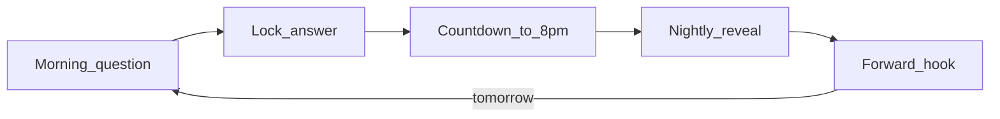

# v1 direction — start here

**Audience:** Antigravity, Leonard, Mekhi, engineering, design, anyone joining the v1 mockup cold.

This document explains **where v1 is going** and **why the mockup is changing**. For local setup, see [V1_STARTING_POINT.md](./V1_STARTING_POINT.md). For the frozen full-canon demo, see [ligo-v0.vercel.app](https://ligo-v0.vercel.app) and [DEPLOY_V0.md](./DEPLOY_V0.md).

---

## Why we're pivoting

LIGO had traction (800+ downloads, local partners) but **retention was the core problem** — users downloaded once and had no daily reason to come back.

The fix is a **hyper-specific daily loop**: one music question per day, lock your answer, then an **8 PM reveal** that shows what campus decided and where you stood. That reveal is the product — not a feed, not a marketplace.

The higher-level principle: the app is a **conduit to real-life connection**. Music identity builds in the background; the reveal makes it feel consequential; Connection Night (later) turns overlap into IRL meetups.

---

## v0 vs v1

| | **v0** (frozen) | **v1** (this branch) |
|---|-----------------|----------------------|
| **Purpose** | Full spreadsheet demo — every screen filled | New product direction — nightly reveal first |
| **Deploy** | [ligo-v0.vercel.app](https://ligo-v0.vercel.app) | Fresh Vercel deploy from `v1` branch |
| **Supabase** | Full canon tables | Profiles only; content APIs return empty bundles |
| **Hero moment** | Connection Night carousel + Wrapped | **Aurora nightly reveal** (every night) |
| **What stayed** | — | 9 profiles, song catalogs, cover art, home fidelity news/shows |

v0 is archived, not deleted. v1 is a clean canvas to build the new loop without breaking the investor-ready frozen demo.

---

## The daily loop



1. **Morning** — Everyone gets the same music question.
2. **Lock in** — You pick a song/artist from synced catalog (or free text).
3. **Wait** — Countdown to 8 PM ET. Anticipation is part of the product.
4. **Reveal** — Full-screen Aurora experience: campus pulse, your standing, mood, forward hook.
5. **Forward hook** — Streak, tomorrow tease, countdown — pulls you back tomorrow.

---

## Three night types

| Night type | Frequency | Status on v1 mockup |
|------------|-----------|---------------------|
| **Reveal Night** | Every night at 8 PM | **Building now** — Aurora UI, one demo night |
| **Connection Night** | Random 1–2× per week, unpredictable | **In progress** — hardcoded demo plan; see [CONNECTION_NIGHT_HARDCODED_PLAN.md](./CONNECTION_NIGHT_HARDCODED_PLAN.md) |
| **Ligo Wrap Night** | End of week, separate moment | Parked — code kept, UI entry removed |

Connection Night and Wrap are real product moments but **not this slice**. The old mockup wrongly treated Connection Night as *the* reveal. v1 corrects that: reveal happens **every night**.

---

## What the reveal is

The reveal is built from **inputs** — content pieces that fire based on data thresholds. Product specs live in [`docs/notes/`](notes/).

### Confirmed V1 inputs (all cold-start viable)

1. Campus Pulse — what campus answered tonight
2. Personal Standing — rarity percentile, majority/minority frame
3. Forward Hook — streak, countdown, tomorrow tease
4. Campus Mood — one generated mood line
5. Personal Recap Card — closing screenshot moment (always last)
6. Question Sneak Peek — tomorrow's question for answerers
7. Music Moment — campus song of the day + clip
8. Share Card — per-input shareables (growth at cold start)
9. Founding Energy Frame — cold-start narrative, retires at 200 DAUs

### Visual direction: Aurora

We chose the **Aurora** treatment from the design prototypes — dark sky, poetic copy, swipe segments:

**Look → Answer → You → Sky → Morrow**

Reference: [`docs/notes/LIGO Reveal Aurora.html`](notes/LIGO%20Reveal%20Aurora.html)

### Emotional design north star

Every line should pass the filter in [`docs/notes/Making Users Feel Something — Ligo Emotional Desig 3793815b115081058fcddd88e34d3ca9.md`](notes/Making%20Users%20Feel%20Something%20%E2%80%94%20Ligo%20Emotional%20Desig%203793815b115081058fcddd88e34d3ca9.md):

- **Recognition over information** — "You went the other way. You always do." beats "Top 7% unique."
- **Positions, not preferences** — answers are stances, not survey responses.
- **Campus as character** — "Georgetown made its call" not "Georgetown voted."

---

## What the mockup is for

A **clickable prototype** for investors, design handoff (Leonard), and engineering alignment. Strategy:

1. **Slice 1 (now)** — One hardcoded demo night, Aurora shell, home flow wired
2. **Slice 2 (next)** — Spreadsheet → JSON import, 847-answer campus distribution
3. **Slice 3 (next)** — Per-profile You card + catalog art lookup when switching profiles
4. **Later** — Real 8 PM scheduling, Connection Night redesign, Wrap Night, share card generator, Mekhi's games (separate codebase)

---

## What's parked (not deleted)

| Item | Status |
|------|--------|
| `HomeConnection` / Connection Night carousel | Code in repo, no home entry point |
| `HomeWrapped` / Weekly Wrapped story | Code in repo, no home entry point |
| `WeekTeasers` component | Function kept in `HomeScreen.tsx`, not rendered |
| Marketplace / org-first GTM model | Retired as primary product framing |
| Mekhi games | Separate; toggle in later, not v1 scope |

---

## Roadmap phases

| Phase | What | Status |
|-------|------|--------|
| **Slice 1** | Aurora reveal shell, one hardcoded night, home flow wired | **Shipped on branch** |
| **Slice 2** | Spreadsheet → JSON import, 847-answer demo data | Next |
| **Slice 3** | Per-profile You card + catalog art lookup | Next |
| **Later** | Real 8pm scheduling, Connection Night redesign, Wrap Night, share cards | TBD |

---

## How to run the mockup

```bash
npm install
npm run dev
```

Open the app in the browser (iPhone frame).

1. Switch profiles from the top-right avatar menu (optional).
2. Read today's question and **lock in** an answer.
3. Tap **Tonight's reveal** — "Look up, Georgetown."
4. Tap **Open tonight's sky** → swipe through five Aurora cards.
5. Dismiss (home button or last slide) → back to home.

**Demo note:** Marcus profile uses a 10-second internal countdown after lock-in (not real 8 PM). Other profiles lock in without auto-reveal.

---

## Further reading

| Doc | Contents |
|-----|----------|
| [`docs/notes/The Reveal — Inputs V1 (Revised)*.md`](notes/) | Confirmed inputs, DAU ladder, copy standards |
| [`docs/notes/`](notes/) | June 8 call notes, emotional design principles |
| [V1_STARTING_POINT.md](./V1_STARTING_POINT.md) | Supabase setup, profiles import |
| [DEPLOY_V0.md](./DEPLOY_V0.md) | Frozen v0 demo deploy |

---

## Current implementation (slice 1.5)

### User flow (Marcus demo)

```
Home → lock answer → 10s countdown → Aurora auto-opens → dismiss → replay card → Home
```

Games hub is on home for all profiles. Connection/Wrapped teasers remain parked.

### Key files

| File | Role |
|------|------|
| [`lib/revealConstants.ts`](../lib/revealConstants.ts) | Marcus demo profile, countdown seconds, question fallback |
| [`lib/revealData.ts`](../lib/revealData.ts) | 10 hardcoded reveal nights (N1–N10) |
| [`components/RevealScreen.tsx`](../components/RevealScreen.tsx) | Full-screen Aurora reveal (5 acts) |
| [`components/RevealShell.tsx`](../components/RevealShell.tsx) | Shared cinematic shell (aurora, transitions) |
| [`components/GamesHub.tsx`](../components/GamesHub.tsx) | Mekhi games integration |
| [`lib/gameQuestions.ts`](../lib/gameQuestions.ts) | Game question sets + `getDayIndex()` |
| [`lib/gameState.ts`](../lib/gameState.ts) | Per-user games progress in localStorage |

### Touched files

| File | Change |
|------|--------|
| [`components/HomeScreen.tsx`](../components/HomeScreen.tsx) | Marcus countdown, `RevealTeaser`, games banner, `RevealScreen`, `WeekTeasers` unmounted |
| [`app/page.tsx`](../app/page.tsx) | Night Preview picker (N1–N10), `games` state, chrome hints |
| [`app/globals.css`](../app/globals.css) | Aurora + games keyframe animations |

### Demo controls

- **Night Preview** (above phone): pick N1–N10 to preview aurora progression; LIVE resets to default night.
- **Reset Marcus reveal** (browser console):

```js
localStorage.removeItem('ligo:reveal:marcus:unlocked');
localStorage.removeItem('ligo:daily:marcus:answered');
```

Per-profile reveal dynamics (spreadsheet import) come in slice 2–3.
